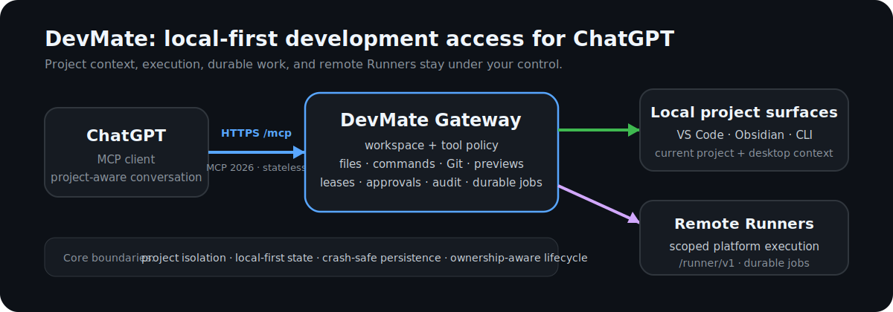

# DevMate

[](https://github.com/Kukutx/DevMate/actions/workflows/ci.yml)
[](https://github.com/Kukutx/DevMate/releases/latest)
[](LICENSE)

**Local-first MCP development gateway for ChatGPT.**

DevMate connects ChatGPT to a real development environment. It can inspect and edit project files, run commands, test changes, use live editor context, and hand long-running work to durable jobs or remote Runners — while workspace and runtime state stay on machines you control.

It works as a VS Code extension, an Obsidian desktop host, a standalone CLI, or a service-backed Gateway.

<p align="center">
  
</p>

## What stands out

- **Real project access** — files, commands, Git, previews, diagnostics, testing, and project-aware context through MCP.
- **Project isolation** — each ChatGPT conversation stays bound to its selected project across reconnects; explicit local paths remain authoritative.
- **Local-first runtime** — the Gateway, project state, credentials, backups, and execution stay on your machine or your own Runner hosts.
- **One desktop runtime** — VS Code and Obsidian share one machine-wide Gateway and public connection instead of competing for separate processes.
- **Durable work** — reviewed jobs survive MCP request boundaries and Gateway restarts.
- **Remote execution when needed** — scoped external Runners can handle platform-specific or long-running work without owning central policy state.
- **Current MCP only** — protocol `2026-07-28`, `server/discover` negotiation, stateless HTTP transport, and legacy transport rejection.
- **Built-in safety boundaries** — workspace containment, protected-path filtering, bounded command output, optional approvals/leases, audit metadata, and ownership-aware process cleanup.

Single-owner MCP defaults to no authentication for both local and public ingress; OAuth is for team/member identity.

## Quick start

### VS Code

1. Open a project.
2. Run **DevMate: Start** — or keep the default auto-start enabled.
3. DevMate starts or attaches to the shared Gateway and configured public connection.
4. Before reporting Ready, DevMate verifies MCP with `server/discover` against protocol `2026-07-28`, then runs `tools/list` and a real read-only `gateway_status` call.
5. Add the verified HTTPS `/mcp` URL to ChatGPT.

Fresh desktop instances use **ngrok** by default. Cloudflare Quick, Cloudflare managed tunnels, and existing external HTTPS ingress are also supported.

The default single-owner `auth.mode: "none"` works for both loopback and configured public MCP. Enable OAuth when the endpoint is shared with team/member identities.

### Standalone CLI

```bash
# Personal instance: single-owner no-auth + embedded execution
npx devmate bootstrap --preset personal --workspace /srv/project

# Start the Gateway owned by the CLI
npx devmate start

# Inspect current state without exposing credentials
npx devmate status
```

For explicit service layouts, custom config paths, Team/Control-plane presets, and portable Windows/Linux packages, see [`docs/STANDALONE.md`](docs/STANDALONE.md) and [`docs/BOOTSTRAP.md`](docs/BOOTSTRAP.md).

### Obsidian

DevMate also ships a desktop-only Obsidian host. It publishes vault context and note workflows through the same shared Gateway/public connection model used by VS Code.

```bash
npm run build:obsidian
```

Copy `obsidian-plugin/dist` into `<Vault>/.obsidian/plugins/devmate/`, then enable the plugin under Community Plugins.

See [`obsidian-plugin/README.md`](obsidian-plugin/README.md) and [`docs/OBSIDIAN_DATA_WORKFLOWS.md`](docs/OBSIDIAN_DATA_WORKFLOWS.md).

## Product surfaces

| Surface | Purpose |
| --- | --- |
| VS Code | Project context, desktop lifecycle, commands, diagnostics, shared public MCP |
| Obsidian | Vault context, note/Property workflows, shared desktop lifecycle |
| Standalone CLI | Editor-independent setup, lifecycle, workspace, plugin, job, and Runner administration |
| DevMate Gateway | MCP server, policy, workspaces, jobs, audit, previews, and plugin capabilities |
| External Runner | Scoped execution on another machine or platform without duplicating central state |

## Authentication presets

| Preset | MCP identity | Execution | Best for |
| --- | --- | --- | --- |
| Personal | `none` by default | Embedded Runner | One developer |
| Team | OAuth members | Embedded Runner, optional external Runners | Trusted shared development |
| Control-plane | OAuth members | External Runners by default | Long-lived managed deployment |
| Runner host | No-auth loopback MCP + scoped `dmr_` credential | Local toolchain | Platform-specific execution |

Presets are setup defaults, not runtime modes. Connection provider, authentication, request policy, workspace coordination, and Runner topology remain independent capabilities.

## Architecture

```text
VS Code / Obsidian / CLI
          │
          │ local host control + project context
          ▼
    DevMate Gateway
    ├─ MCP 2026 transport
    ├─ workspace + tool policy
    ├─ files / commands / Git / previews
    ├─ leases / approvals / audit
    ├─ durable job queue
    └─ optional platform plugins
          │
          │ HTTPS /mcp
          ▼
       ChatGPT

    DevMate Gateway
          │ /runner/v1 + scoped dmr_ credential
          ▼
    External Runner hosts
          └─ local toolchains and workspaces
```

The central Gateway remains authoritative for workspace scope, identity, approvals, leases, job ownership, retries, and cancellation. External Runners distribute execution only.

VS Code and Obsidian coordinate one machine-wide desktop state directory and one provider-native public connection. Ready evidence is generation-bound: a Gateway restart, provider restart, ownership transfer, or endpoint-generation change invalidates stale verification even if the public hostname stays the same.

See [`docs/ARCHITECTURE.md`](docs/ARCHITECTURE.md) for the full runtime model.

## Project and workspace model

DevMate treats project selection as a real boundary, not UI state:

- explicit absolute local paths take precedence over editor/vault defaults;
- new ChatGPT conversations can adopt the current VS Code/Obsidian project when no path is supplied;
- reconnects do not silently drift a conversation to another project;
- sessions, leases, previews, and jobs remain project-scoped;
- same-project conversations can still continue shared work records where policy allows it;
- writable and readonly/reference workspaces remain distinct.

This keeps normal project switching lightweight without mixing work between unrelated repositories.

## Durable jobs and Runners

Long-running work can continue beyond one MCP request:

```text
job_target_catalog
job_submit
job_list
job_status
job_artifacts
job_cancel
job_retry
runner_status
```

The queue accepts reviewed targets such as smart checks, configured scripts, Browser QA, Godot audits/tests, performance checks, capture, exports, release reports, snapshots, and non-pushing `git_save`. Arbitrary queued shell commands, direct push, force operations, and credential-bearing arguments are rejected.

External Runners use dedicated `dmr_` credentials accepted only by `/runner/v1`. Runner-reported capabilities and workspace IDs are intersected with credential scope; they cannot widen their own authorization.

See [`docs/JOBS.md`](docs/JOBS.md) and [`docs/EXTERNAL_RUNNERS.md`](docs/EXTERNAL_RUNNERS.md).

## Optional capabilities

Optional plugins stay disabled until enabled.

- **Browser QA** — local previews, Playwright scenarios, screenshots, reports, and structured app-state assertions.
- **Godot** — project/runtime audit, dependency graphs, native and Web acceptance, performance budgets/regressions, deterministic Movie Maker capture, GUT/GdUnit4 workflows, quality reports, release gates, and multi-platform exports.
- **Codex Collaboration** — proposal-snapshot collaboration with network-off supervised execution and explicit reviewed apply boundaries.

Repeatable project automation can be committed in `.devmate/automation.json`.

See [`docs/PLUGINS.md`](docs/PLUGINS.md), [`docs/AUTOMATION_MANIFEST.md`](docs/AUTOMATION_MANIFEST.md), and the Godot documentation linked below.

## Security model

`auth.mode: "none"` is the intentional single-owner trust model. It grants owner access to requests that can reach the configured MCP ingress, so use it only when that endpoint is private to the owner. OAuth is opt-in for team/member identity and shared access.

Other important boundaries:

- the Gateway binds to loopback by default;
- credentials are never accepted in MCP URLs;
- real `.env` files, keys, databases, logs, and credential-shaped paths are blocked from normal file tools;
- workspace operations enforce lexical and realpath containment;
- commands run as the DevMate OS identity and are not a hostile-code sandbox;
- Runner credentials, OAuth identities, provider credentials, preview shares, and MCP access are separate trust domains;
- configuration and durable coordination state use cross-process locking and crash-safe atomic replacement;
- unsupported future config/state versions fail closed rather than being silently downgraded.

For shared or organizational deployments, use OAuth, scoped members, optional workspace leases, approvals, bounded request policy, and separate OS/VM/container trust domains where appropriate.

See [`SECURITY.md`](SECURITY.md) and [`docs/AUTHENTICATION.md`](docs/AUTHENTICATION.md).

## Verification and engineering quality

The repository runs more than source-level tests. CI covers the actual packaged/runtime boundaries used by the product:

- Windows + Node 24 + real VS Code Extension Host E2E;
- Node Current compatibility;
- Linux runtime, Docker network smoke, and real Godot validation;
- packaged VSIX runtime and shared-tunnel smoke tests;
- Obsidian bundle/runtime smoke tests;
- portable Windows and Linux CLI packages;
- dependency audits, architecture contracts, unit/policy tests, and Gateway smoke tests.

Local verification:

```bash
npm ci
npm run check
npm run test:unit
npm run smoke:gateway
npm run package:vsix
```

## Godot support

The optional Godot capability is deliberately broader than a command wrapper. It can verify the editor/toolchain, audit project structure, build dependency graphs, install the QA bridge, run native/Web acceptance, sample performance monitors, compare reviewed baselines, capture deterministic AVI evidence, run GUT/GdUnit4 tests, produce quality reports, and route exports to matching Runners.

The repository's Linux CI uses a real Godot 4.7.1 editor under Xvfb for native QA, performance sampling, and deterministic Movie Maker capture.

See:

- [`docs/GODOT_AUTOMATION.md`](docs/GODOT_AUTOMATION.md)
- [`docs/GODOT_RUNTIME_QUALITY.md`](docs/GODOT_RUNTIME_QUALITY.md)
- [`docs/GODOT_TEST_PERFORMANCE.md`](docs/GODOT_TEST_PERFORMANCE.md)
- [`docs/GODOT_RELEASE_MATURITY.md`](docs/GODOT_RELEASE_MATURITY.md)

## Operations

Prometheus-compatible metrics are loopback-only:

```text
http://127.0.0.1:8787/control/metrics
```

Deployment examples are included for systemd, Docker, external Runner hosts, and Caddy reverse proxying under `deploy/`.

## Documentation

- [`docs/ARCHITECTURE.md`](docs/ARCHITECTURE.md) — runtime topology and current architecture
- [`docs/AUTHENTICATION.md`](docs/AUTHENTICATION.md) — single-owner and OAuth identity model
- [`docs/BOOTSTRAP.md`](docs/BOOTSTRAP.md) — setup presets
- [`docs/STANDALONE.md`](docs/STANDALONE.md) — CLI, service, and portable usage
- [`docs/HOST_INTEGRATION.md`](docs/HOST_INTEGRATION.md) — VS Code/Obsidian lifecycle
- [`docs/JOBS.md`](docs/JOBS.md) — durable jobs
- [`docs/EXTERNAL_RUNNERS.md`](docs/EXTERNAL_RUNNERS.md) — Runner protocol and deployment
- [`docs/TEAM_DEPLOYMENT.md`](docs/TEAM_DEPLOYMENT.md) — shared access and hardened deployments
- [`docs/TUNNELS.md`](docs/TUNNELS.md) — public connection providers
- [`docs/PLUGINS.md`](docs/PLUGINS.md) — optional capability plugins
- [`docs/MCP_TOOLS.md`](docs/MCP_TOOLS.md) — tool catalog
- [`SECURITY.md`](SECURITY.md) — trust boundaries and security policy

## License

MIT
