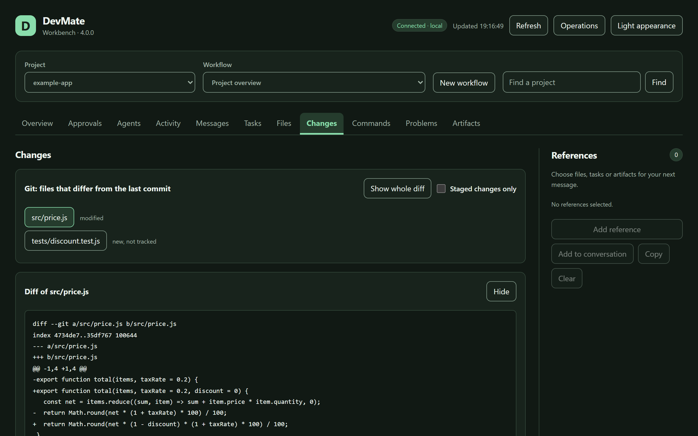

# DevMate

[English](README.md) | [简体中文](README.zh-CN.md)

[](https://github.com/Kukutx/DevMate/actions/workflows/ci.yml) [](https://marketplace.visualstudio.com/items?itemName=kukutx.devmate-agent) [](https://github.com/Kukutx/DevMate/releases) [](LICENSE)

DevMate lets the model in your chat window work directly on your own computer: read, search and edit project files, run commands and tests, use Git, see the errors your editor already reports, and hand whole tasks to the coding agents installed on your machine. It is a local runtime that offers these capabilities through the [Model Context Protocol](https://modelcontextprotocol.io) (MCP).

The main use is connecting the ChatGPT website to your machine and developing with the chat subscription you already pay for. It is not tied to ChatGPT: Claude and every other MCP client connect to the same runtime.

- **Your machine, your route.** Nothing is relayed through a service of ours. Cloud clients reach you through a tunnel you own (Cloudflare, OpenAI's official tunnel, your reverse proxy, or SSH), and DevMate proves the route end to end.
- **You decide what is shared, at your computer.** Which folders, read only or read and write, credential files protected. A connected client can narrow these and never widen them.
- **One runtime for every entry.** Any number of VS Code windows, Obsidian and the command line share one runtime per machine, guaranteed by the operating system.
- **It knows what your editor knows.** Compiler, type and lint errors come straight from VS Code, without running a build.

```
 ChatGPT web · Claude.ai                    Claude Code · Codex · any local MCP client
          │  HTTPS through your own tunnel                 │  http://127.0.0.1:8788/mcp
          ▼                                                ▼          or `devmate mcp` (stdio)
   ingress port 8789 ───────────────┐      ┌─────────────── control port 8788
   MCP and OAuth only               ▼      ▼                owner only: CLI, editors, workbench
                              ┌──────────────────┐
                              │  DevMate runtime │  one per instance directory
                              │  every call is   │  files · search · Git · shell
                              │  authorised here │  editor diagnostics · agents
                              └──────────────────┘
                                 ▲      ▲      ▲
                         VS Code windows · Obsidian · `devmate` command line
```



DevMate 4 is a new architecture. It does not read, migrate or stay compatible with any 3.x state, configuration or interface. [Coming from 3.x?](#upgrading-from-3x)

## Install

**Requirements:** Node.js 24 or newer, and Git 2.41 or newer (the Git that ships with the macOS developer tools is older: `brew install git`). The command line and Obsidian also need `rg` ([ripgrep](https://github.com/BurntSushi/ripgrep)); the VS Code extension brings its own.

| Entry | Install |
| --- | --- |
| VS Code extension | Search for **DevMate** in the Extensions view, or run `ext install kukutx.devmate-agent`. Offline: download `devmate-<version>.vsix` from [Releases](https://github.com/Kukutx/DevMate/releases) and run `code --install-extension devmate-<version>.vsix` |
| Obsidian plugin | **Settings → Community plugins → Browse → DevMate**. Manually: unpack `devmate-obsidian-<version>.zip` from Releases into `<vault>/.obsidian/plugins/devmate/` and enable it. Desktop only |
| Command line | Download `devmate-cli-<version>.tgz` from Releases and run `npm install -g ./devmate-cli-<version>.tgz`. It has no dependencies and installs offline. Remove it with `npm uninstall -g devmate-agent` |

`devmate doctor` (or **DevMate: Doctor** in an editor) checks everything this installation needs and prints the exact command to fix each item for your system.

## The first five minutes

With VS Code:

1. Open a project folder and run **DevMate: Start DevMate Runtime** from the Command Palette. The folder is shared, read and write, and the window tells you so once.
2. Run **DevMate: Copy MCP URL**. For a client on the same computer that is all: `claude mcp add --transport http devmate http://127.0.0.1:8788/mcp`.
3. For ChatGPT on the web or Claude.ai, run **DevMate: Configure Connection** once (see [Connecting a client](#connecting-a-client)), then add the copied address as a custom MCP connector.
4. Ask the model for "an overview of my project". It calls `project_overview` and you are working.

With the command line only:

```powershell
devmate start                          # start the background runtime, or join the one that runs
devmate project add C:\Projects\Example
devmate doctor
devmate mcp-url                        # the address to give a client
devmate ui --open                      # the workbench in your browser
```

## Three entries, one runtime

| Entry | For | Adds |
| --- | --- | --- |
| `devmate` command line | Working without an editor | Everything: start, share folders, configure the connection, open the workbench, call any operation. `devmate mcp` serves MCP on standard input and output for clients that start their servers as a program |
| VS Code extension | Everyday development | The editor's diagnostics, active file and selection; a status bar item |
| Obsidian plugin | A knowledge base | Note search, properties, graph and vault operations |

One instance directory (default `~/.devmate/runtime`) has exactly one runtime process at a time.

- Several VS Code windows, Obsidian and the command line can run together. Pressing Start in all of them starts one runtime; the others join it.
- Each editor window works on its own folders. Closing a window affects neither the runtime nor the other windows.
- **The runtime keeps running after you close the editor**, with its public connection if you configured one, until you stop it: `devmate stop`, or **Stop DevMate Runtime** in an editor. Stopping affects every entry, so the editors ask first.
- After a crash the next start simply works. VS Code with `devMate.autoStart` brings a crashed runtime back; one you stopped stays stopped.

## Command line

| Command | Purpose |
| --- | --- |
| `devmate start` / `stop` / `restart` / `status` | The background runtime |
| `devmate serve` | Run in the foreground until Ctrl+C |
| `devmate doctor` | Check the installation. Works when nothing is running and says what to do next |
| Start at sign-in, without an editor | Have your system run `devmate start` when you sign in: a Task Scheduler task on Windows, a systemd user unit on Linux, a launchd agent on macOS |
| `devmate logs [--lines N]` | Recent runtime log |
| `devmate project add [directory] [--name N] [--read-only]` / `list` / `remove` | What is shared. Without a directory, the current one |
| `devmate access [guarded \| full]` | The permission profile: what a connected client may decide (see [Who may do what](#who-may-do-what)) |
| `devmate mcp-url` | The address for a client |
| `devmate mcp` | MCP over standard input and output; starts the runtime when needed |
| `devmate connect local \| cloudflare \| openai-tunnel \| https \| ssh …` | How cloud clients reach this computer. `--auth oauth` requires sign-in |
| `devmate secret set <NAME>` / `list` / `remove <NAME>` | Connection credentials. The value is read from standard input and never appears in shell history |
| `devmate login-code` | A one-time sign-in code (when sign-in is on) |
| `devmate ui [--open]` | A single-use link to the workbench |
| `devmate operations` / `help <operation>` | Every operation, and one with its exact input |
| `devmate <operation> --json '{…}'` | Call any operation; also `--file` or `--stdin` |

Every command accepts `--instance <directory>` to use another instance. The command line can do everything the workbench and the extensions can.

Commands run in PowerShell on Windows: PowerShell 7 when it is installed, otherwise the built-in 5.1. Version 5.1 has no `&&` and `||`, which models use by habit, so installing PowerShell 7 is recommended (`winget install Microsoft.PowerShell`). On macOS and Linux commands run in bash, or `sh` when there is no bash.

## VS Code extension

Commands (all under **DevMate:** in the Command Palette):

| Command | Does |
| --- | --- |
| Start / Stop / Restart DevMate Runtime | The shared runtime |
| Change Folder Sharing | Read and write, read only, or not shared, per folder |
| Select This Window Workspace | Which shared folder this window works in, when it shares several |
| Configure Connection | The guided setup for cloud clients, and whether they must sign in |
| Copy MCP URL · Copy One-Time Sign-In Code | What a client needs |
| Open Workbench · Doctor · Show Menu · Show Runtime Status | Seeing what is going on |
| Discover Operations · Call Operation | Looking into a problem |

Settings (user settings only: a repository's `.vscode/settings.json` cannot change them):

| Setting | Default | Meaning |
| --- | --- | --- |
| `devMate.shareFolders` | `readWrite` | What connected clients may do in a trusted folder you open: `readWrite`, `readOnly`, `ask`, `never`. Folders of an untrusted workspace are never shared |
| `devMate.shareEditorContext` | `true` | Whether clients see the active file, selection, open files and diagnostics |
| `devMate.autoStart` | `true` | Start the runtime with the editor, and again after a crash. One you stopped stays stopped |
| `devMate.runtimePort` | `8788` | The local port when this editor starts the runtime |
| `devMate.nodeCommandPath` | empty | A Node.js 24+ executable, when it is not found on its own |
| `devMate.runtimeInstanceDirectory` | empty | Another instance directory than `~/.devmate/runtime` |

- An opened folder is shared read and write by default, and the window says so once with a **Change…** button. A folder you take out stays out until you share it again.
- No separate ripgrep is needed: when PATH has no `rg`, the runtime uses the copy VS Code ships and remembers it for use without the editor.
- Editors with built-in MCP support discover the local endpoint on their own.
- The extension needs VS Code 1.101 or newer and is tested in a real editor on 1.101 and 1.133.
- **Remote windows (SSH, WSL, Dev Containers):** the extension runs on the remote side, so DevMate, Node.js and the shared folders are those of the remote computer, and "local" addresses are local to it. This setup is not tested yet.

## Obsidian plugin

- **DevMate: Start runtime** starts the runtime; the status bar shows its state and opens the sidebar.
- **DevMate: Attach this vault** shares the vault and offers the note tools (search, properties, graph, move, trash). The first time it asks: read and write, read only, or not now. The whole vault folder is shared, so connected clients also reach it with the file tools.
- **DevMate: Change how this vault is shared** changes that at any time. **Detach** only stops the note tools; sharing is unchanged.
- **DevMate: Stop shared runtime** and **Restart shared runtime** ask first, because they affect every entry.
- When an agent waits for your approval or an answer, Obsidian tells you; **DevMate: Open workbench** is where you answer.

**Disclosures.** The plugin is desktop only and needs Node.js 24 installed separately (set its path in the plugin settings when it is not found; ripgrep must be installed too). It starts the DevMate runtime as a background process that keeps running after Obsidian closes, until you run **Stop shared runtime**. The runtime listens on `127.0.0.1` only (ports 8788 and 8789, and one more loopback port for vault operations). Its state, credentials and its own program files are kept in `~/.devmate/runtime`, outside the vault. The plugin carries those program files inside `main.js` as plain, readable text (nothing is encoded), writes them there and checks each against its hash on every start. It makes no network connection unless you configure a public connection (Cloudflare Tunnel, OpenAI Secure MCP Tunnel, SSH or your own HTTPS proxy). No telemetry, no account, no payment.

The 4.0 plugin has been loaded and driven in a real Obsidian 1.12.7 on Windows: loading, starting the runtime, sharing the vault read only and read and write, the note tools, stopping and disabling. Obsidian on macOS and Linux, and an update over an installed 3.x plugin, have not been tried. Please report what you find.

## Connecting a client

### On the same computer

No tunnel and no sign-in:

```
http://127.0.0.1:8788/mcp
```

| Client | Setup |
| --- | --- |
| Claude Code | `claude mcp add --transport http devmate http://127.0.0.1:8788/mcp` |
| Codex CLI | `codex mcp add devmate --url http://127.0.0.1:8788/mcp` |
| VS Code's own MCP support | Found automatically once the extension is installed |
| A client that only starts programs | Command `devmate`, argument `mcp`, for example `{ "command": "devmate", "args": ["mcp"] }` |

Any other client: add an HTTP (Streamable HTTP) MCP server with this address. A browser-based client on another origin is refused until you add its origin to `allowedOrigins` in the DevMate configuration; add only clients you run yourself.

### ChatGPT on the web and Claude.ai

They reach your MCP server from the cloud, so they need a route from outside to your machine. DevMate offers four, none of which depends on ngrok:

| Route | For | Notes |
| --- | --- | --- |
| `openai-tunnel` | ChatGPT, Codex | OpenAI's official tunnel. Outbound only, no public address, no domain |
| `cloudflare` | ChatGPT, Claude, any client | A named Cloudflare tunnel on your own domain; DevMate runs `cloudflared`. Free |
| `https` | Any client | A reverse proxy you already run |
| `ssh` | Any client | OpenSSH reverse forwarding to a server of yours that provides HTTPS |

**Cloudflare tunnel**

1. In Cloudflare Zero Trust create a tunnel with a public hostname such as `devmate.example.com`, and set its service to `http://127.0.0.1:8789`.
2. Configure it and store the token:

```powershell
devmate connect cloudflare --url https://devmate.example.com/mcp --executable "C:\Program Files (x86)\cloudflared\cloudflared.exe"
devmate secret set CLOUDFLARE_TUNNEL_TOKEN      # paste the token and press Enter, or pipe it in
devmate restart
devmate doctor
```

3. Give the address printed by `devmate mcp-url` to ChatGPT or Claude as a custom MCP connector.

**OpenAI tunnel**

Create a tunnel in the organisation settings of the OpenAI Platform and download the official `tunnel-client`:

```powershell
devmate connect openai-tunnel --tunnel-id tunnel_xxxxxxxx --executable C:\Tools\OpenAI\tunnel-client.exe
devmate secret set CONTROL_PLANE_API_KEY
devmate restart
```

`devmate mcp-url` prints the tunnel ID; choose the Tunnel connection type in ChatGPT and enter it.

**Is it really connected?**

A running tunnel process is not a working route. DevMate connects back through the public address as a real MCP client, lists the tools and calls one, and the answer must come from this very runtime; it repeats the check periodically and says so when the route breaks. The route works when `connection.public` is `ok` in `devmate doctor`. The OpenAI tunnel has no public address to probe: confirm it by calling a tool from ChatGPT.

A connector that cannot start does not take local work down and is never hidden: `doctor` and `connection.status` give the reason. After storing a new credential, restart only the connector: `devmate connection.restart`.

## Who may do what

- **Two ports, two levels of trust.** The control port (default `127.0.0.1:8788`) is yours alone: workbench, command line, editors, MCP clients on this computer. The ingress port (default `8789`) serves only MCP and OAuth and is the only thing a tunnel or proxy points at; the control port refuses anything that arrived through a proxy.
- **What is shared is decided at your computer.** Folders are shared from an editor, with `devmate project add`, or in the local workbench. A connected client cannot share a folder, widen read-only access, lift the protection of credential files or bring back a folder you took out; it can only narrow.
- **Write access is full access.** In a writable project a client can run commands, and commands run as your operating-system account. With at least one writable project the limits on other folders keep a well-behaved model in place; they are not a wall against a hostile one. For a client you do not fully trust, share read only: then there are no commands and the limits hold. DevMate is not a sandbox.
- **`auth.mode` is `none` by default.** Whoever reaches the MCP address is you. Treat a public address like a password, or require sign-in.
- **Optional sign-in (OAuth).** `devmate connect … --auth oauth` makes clients of the public address sign in: on first connection they are sent to DevMate's authorisation page, where you enter a one-time code from `devmate login-code`. With `auth.member.create` you can issue read-only or read-write identities limited to named projects. A client that publishes no description of itself (a client metadata document) is registered by you under `auth.clients` in the configuration, with its name and redirect addresses. Clients on your own computer never need to sign in.
- **Approvals and questions are answered by you, at your computer.** When an agent asks for permission, you answer in the editor or the local workbench. No connected client can answer, including the model that started the agent.
- **Full access, when you want none of that in your way.** The default profile is *guarded*: everything above. If you drive your work from a chat client and do not want to walk to the computer, switch on *full access* there: `devmate access full`, **DevMate: Change Permission Profile** in VS Code, or **Permissions…** in Obsidian. A client connected as you can then share folders, widen access, read credential files, set up capability engines, answer what an agent asks and run the doctor, and what an agent you delegated to asks permission for is granted automatically (each grant stays on record). It takes effect at once and only you, at your computer, can switch it on; `devmate access guarded` takes it back. With full access, whoever reaches your MCP address acts as you without asking: keep the address private or require sign-in. Signed-in members keep exactly their grants.
- **Credential files are protected by default.** `.env`, key files, `.npmrc` and the like are not read or listed by the file tools; Git status names them, marked "do not commit". You can switch that off for one project, at your computer.
- **Secrets in command lines are not shown.** Process lists and activity records replace inline tokens and passwords with `[redacted]`; the command that runs is unchanged. This recognises common forms and is no guarantee.
- **The workbench session stays in its browser tab.** It is entered through a single-use link, and its session is never a cookie that other local services would receive.
- File contents, command output and web pages the model reads are data, never instructions to it.

[SECURITY.md](SECURITY.md) has the full policy and the known limits.

## Tools the model gets

| Area | Tools | Notes |
| --- | --- | --- |
| Orientation | `project_overview` `project_list` | Git branch and changes, the project's own agent instructions (`AGENTS.md` and similar), runnable scripts, top-level layout and the editor's error count, in one call |
| Editor | `editor_diagnostics` `editor_context` | The compiler, type and lint errors VS Code already computed; your active file, selection and open files |
| Finding code | `workspace_files` `workspace_find` `workspace_search` | Directory listing, glob find, ripgrep content search. Honours `.gitignore`; fast on large repositories |
| Reading | `workspace_read` | With line numbers, paged for large files (up to 32 MiB). UTF-16 and local legacy encodings can be read, not rewritten |
| Changing | `workspace_edit` `workspace_write` `workspace_mkdir` `workspace_move` `workspace_delete` | Exact text replacement, several edits applied atomically. Overwriting needs the hash that was read, so nothing is written blind |
| Undo | `workspace_history` `workspace_restore` | Every file changed, overwritten or deleted through DevMate can be restored, kept 30 days by default |
| Running | `shell_run` `process_read` `process_write` `process_stop` `process_list` | Real shell semantics (`npm test`, `git commit`). Output is paged by cursor; long commands keep running and can be read, fed input and stopped as a whole process tree |
| Git | `git_status` `git_diff` `git_log` `git_show` `git_blame` `git_branches` | Read only, and never run a program the repository configures. Writes go through `shell_run` |
| Delegation | `agents_delegate` `agents_result` `providers_list` | Hand a whole task to a coding agent on this machine |
| Domain capabilities | `capability_list` `capability_call` | Browser control and QA, Godot, reverse engineering, Obsidian, and external MCP servers you configure |
| Everything else | `operations_list` `operations_call` `connection_status` | Workflows, tasks, messages between agents, jobs, artifacts and references, called by name |

- `projectId` is a project id, a project's root directory or a unique project name, and can be left out when only one project is shared. With several, read-only tools follow the editor window you are working in; a change must name its project.
- There is no tool for sharing a folder. That is yours to do; the model is told to ask you.
- The model carries about three dozen tool definitions; the rest costs no context.
- Tools carry accurate hints (read only, write, destructive, open world), so clients ask for confirmation only where it matters.
- A cancelled or timed-out call only stops waiting: the command or agent task it started continues and stays reachable.
- The server speaks MCP 2026-07-28 and the 2025 revisions.
- The reverse-engineering engine includes tools that read, and can write, the memory of another process on Windows. Both are off until you switch them on at your computer (`allowProcessAccess`, `allowMemoryWrite`); a connected client cannot. See [docs/CAPABILITIES.md](docs/CAPABILITIES.md) for all engines.

## Delegating to coding agents on this machine

One call hands a task to Codex, Claude Code, Gemini CLI or Grok CLI installed here:

```json
{ "projectId": "Example", "provider": "claude", "prompt": "Fix the failing case in tests/login.test.ts and say why it failed" }
```

- A task that finishes within the wait returns its result and the list of changed files; otherwise it returns an `agentId` to follow with `agents_result`.
- Passing the same `agentId` again continues that session with its context.
- The agent works in the project folder with its own account, quota and tools. What it asks you (approvals, questions) appears in the workbench and as a notification in VS Code and Obsidian, and you answer it at your computer.
- Collaboration inside one vendor (Claude Code sessions messaging each other, Codex sub-agents) is done natively by them. DevMate covers the part between clients, for example handing a task from ChatGPT on the web to Claude Code on your machine.

For several agents exchanging messages and tasks in one workflow, use the finer `workflow.*`, `agents.*`, `message.*` and `task.*` operations, or the workbench.

## Workbench

`devmate ui --open` opens the workbench in your browser: projects, files, changes, commands, editor problems, agents and their activity, messages, tasks, approvals, artifacts and references. `open_devmate_workbench` opens the same interface inside clients that support MCP Apps (ChatGPT, Claude and others); there it shows everything, while sharing a folder and answering an agent stay at your computer.

## Troubleshooting

Run `devmate doctor` first. It names the item that is wrong and how to fix it.

| What you see | Cause and remedy |
| --- | --- |
| `DevMate runtime is not running` | `devmate start`, or start it in an editor |
| `Port 8788 … is already used by another program` | Another port: `devmate start --port 8790`, or the setting `devMate.runtimePort` |
| `DevMate needs Node.js 24 or newer` | Install Node.js 24+, or set the path of its executable in the DevMate settings of the editor |
| `Git … is too old` | Update to Git 2.41 or newer, then restart DevMate |
| A note that PowerShell 5.1 has no `&&` | Have the model use `;` and `if ($?) { … }`, or install PowerShell 7 and restart DevMate |
| The model says folders are "shared by the owner on their own computer" | Share the folder yourself: open it in an editor with DevMate, or `devmate project add <folder>`. To let your client do such things itself: `devmate access full` |
| The model says a project is read only, or a folder was taken out of sharing | That was your decision at this computer. Change it there: **Change Folder Sharing** in the editor, `devmate project add`, or the local workbench |
| "Answer this on your computer" in an embedded workbench, or an agent that keeps waiting for approval | Approvals are answered locally: `devmate ui --open`, or the notification in your editor. With `devmate access full` they are granted automatically |
| `rg was not found on PATH` | Install ripgrep as the message says, then `devmate restart`; or open DevMate once in VS Code, whose copy is then used |
| `The origin … is not allowed` | A browser-based client: add its origin to `allowedOrigins` in the configuration if you run that client yourself |
| A cloud client cannot connect | The `connection.*` items of `doctor`; `devmate logs` shows the connector's output |
| Start fails | The message has the reason; the full log is `runtime.log` in the instance directory |

## Upgrading from 3.x

4.0 starts fresh. After the update:

- Nothing of 3.x is read: projects, connection and sign-in are set up again. Old settings in your editor are ignored; old state on disk is left alone and can be deleted.
- ngrok, the Gateway and Runners are gone. Cloud clients now come in through a tunnel you own, see [Connecting a client](#connecting-a-client). The MCP address changes, so update the connector in ChatGPT or Claude.
- DevMate no longer starts ngrok for you. A reserved ngrok domain still works as an existing HTTPS proxy: run `ngrok http 8789 --url https://<your-domain>` yourself (the ingress port, not 8788) and tell DevMate with `devmate connect https --url https://<your-domain>/mcp`, then `devmate restart`.
- If a 3.x Gateway is still running it may hold port 8788, and 4.0 then reports that the port is in use. Close every editor window once, or end the old `node` process, and start again.
- The tool names a model sees have changed; clients pick them up when the connector is refreshed.

## Uninstalling

Removing the extension or the plugin does not stop the runtime, because other entries may be using it. Stop it first (**Stop DevMate Runtime**, or `devmate stop`), then uninstall. Everything DevMate keeps is in the instance directory (`~/.devmate/runtime` by default): delete it to remove the state, the credentials and the restorable file versions. Your project files are never touched by this.

## Data and retention

State lives in one SQLite database in the instance directory. The event journal, operation receipts, finished jobs and approvals, and restorable file versions are pruned after `retentionDays` (default 30). Projects, workflows, messages and tasks are not pruned.

## Compatibility

Within 4.x these are treated as public: the names and parameters of the tools above, operation names, configuration keys, command-line commands and the workbench resource `ui://devmate/workbench/v1`. A change to any of them is listed in the changelog, and a rename keeps the old name working for one minor release. A test pins the tool names and parameters, so none changes by accident. The stored state carries a format number: a release never touches state written by a newer one and says which versions are involved. 4.x does not read 3.x state.

## Development

```powershell
npm ci
npm run lint               # mistakes only: undefined names, unreachable code and the like
npm run check              # manifest, versions, pinned workflow actions, syntax
npm run test:unit          # the whole test suite
npm run test:vscode-host   # the extension in a real VS Code: two editors and a third window on one runtime
npm run candidate          # build once, smoke-test that build as packaged, write what a release publishes to dist/release/
```

Pushing a tag `X.Y.Z` that matches the package version (no `v`) verifies that commit and publishes the GitHub release and the VS Code Marketplace version. [CONTRIBUTING.md](CONTRIBUTING.md) describes the release steps.

| Directory | Contents |
| --- | --- |
| `runtime/` | The runtime: the one entry and authorisation of every call (`service.mjs`), all operations (`operations/`), SQLite state (`store.mjs`), the MCP layer (`mcp.mjs`), HTTP (`main.mjs`), the instance lock, commands and processes, files and Git, connections, agent adapters (`agents/`) |
| `runtime/engines/` | Browser, Godot, reverse engineering and other domain capabilities |
| `runtime/platform/` | Process trees, paths, tools and other low-level helpers |
| `workbench/` | The workbench, shared by the MCP App and the local page |
| `vscode-host/` `obsidian-plugin/` | The two hosts |
| `tests/` `scripts/` | Tests; build, check, smoke and packaging scripts |

Every operation is defined once in `runtime/operations/` and authorised by the registry in `runtime/service.mjs`. MCP, the command line and the workbench all get it from there.

## Documentation

- [Capabilities](docs/CAPABILITIES.md): browser, Godot, reverse engineering, Obsidian
- [Security policy](SECURITY.md) and its known limits
- [Changelog](CHANGELOG.md)
- [Contributing and releasing](CONTRIBUTING.md) · [Support](SUPPORT.md) · [Code of conduct](CODE_OF_CONDUCT.md)
- [Audit of 4.0](docs/AUDIT-4.0.md) (in Chinese): what three review rounds found, what was fixed and what could not be verified

## License

[MIT](LICENSE)
